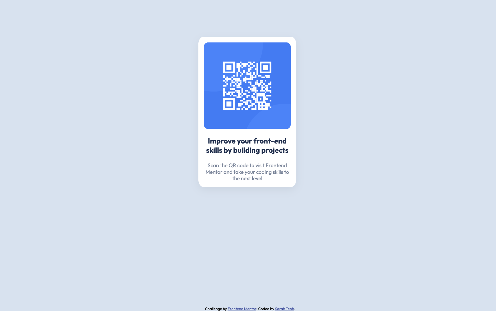

# Frontend Mentor - QR code component solution

This is a solution to the [QR code component challenge on Frontend Mentor](https://www.frontendmentor.io/challenges/qr-code-component-iux_sIO_H). 

## Table of contents

- [Overview](#overview)
  - [Screenshot](#screenshot)
  - [Links](#links)
- [My process](#my-process)
  - [Built with](#built-with)

## Overview

### Screenshot
##### Desktop

##### Mobile

### Links

- Live Site URL: [QR code component](https://sarahteoh.github.io/qr-code-component/)

## My process

### Built with

- HTML
- CSS custom properties
- Flexbox

